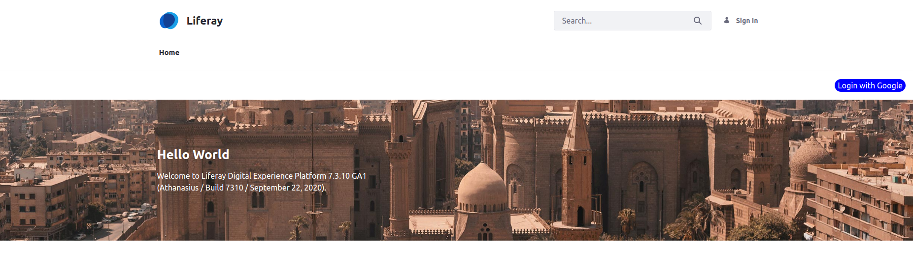

Inspired by https://liferay.dev/en/b/how-to-leverage-liferay-web-content-to-integrate-a-single-sign-on-solution-

Make sure to create a new page called 'admin' where you drop the signin portlet.
Also don't forget to setup OpenID Connect with Google.
